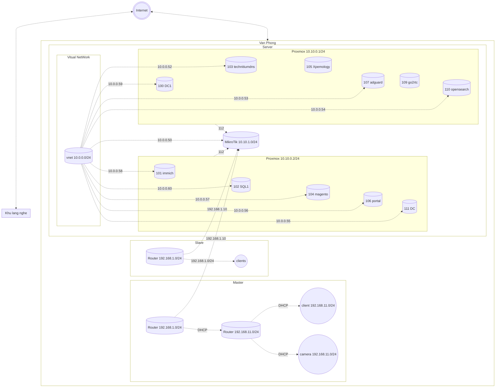

# Networking

| Interface | Type        | Address         |
| --------- | ----------- | --------------- |
| VPN       | WG          | 10.20.1.0/24    |
| ROUTER    | thd1        | 192.168.1.0/24  |
| ROUTER    | thd2        | 192.168.1.0/24  |
| ROUTER    | kct1        | 192.168.12.0/24 |
| WAN       | PVE SDN     | 10.0.0.0/24     |
| WAN       | PVE Forward | 10.0.1.0/24     |
| LAN       | Cluster     | 10.10.0.0/24    |
| LAN       | VM Mikrotik | 10.10.1.0/24    |

# Diagrams

